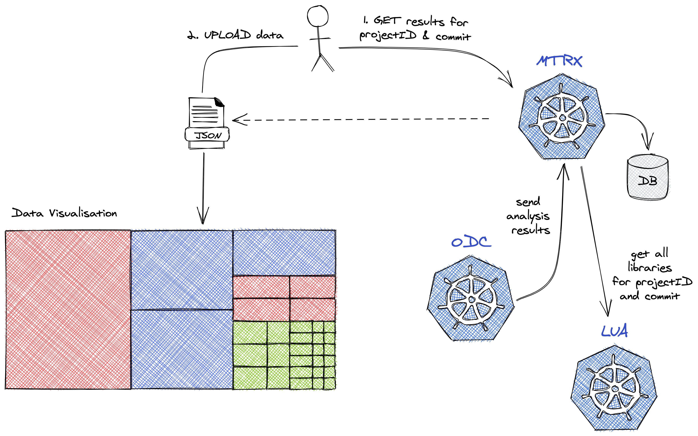

# MTRX - Metrics service

MTRX is a microservice that was designed to collect and aggregate analysis data coming from
other microservices. 



## How it works?

MTRX is receiving analysis data from [ODC](https://github.com/iantal/odc) when the 
analysis in complete. Then it calls [LUA](https://github.com/iantal/lua) via GRPC for the vulnerable libraries to obtain the
project files that are using them.  

The aggregated data is presented as a JSON using the following template:

```json
{
  "file": "",
  "name": "",
  "category": "Security",
  "value": 0
}
```

* file: relative path of the file
* name:
    * **NumberOfVulnerabilities**: total number of vulnerabilities
    * **CriticalVulnerabilities**: number of critical vulnerabilities
    * **HighVulnerabilities**: number of high vulnerabilities
    * **MediumVulnerabilities**: number of medium vulnerabilities
    * **LowVulnerabilities**: number of low vulnerabilities
    * **WeightedSeverityCount**: sum of all weights
      * CRITICAL = 16
      * HIGH = 8
      * MEDIUM = 4 
      * LOW = 2
    
* category: is always set to `Security`
* value: represents the metric value as an integer

## Prerequisites:
- kind
- docker
- k8s
- k9s (optional)

